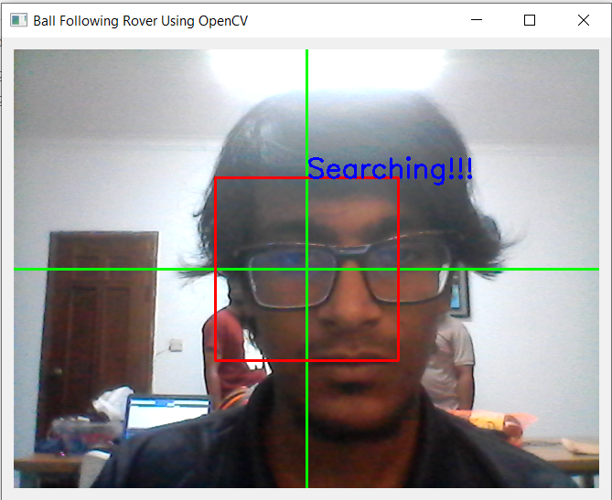
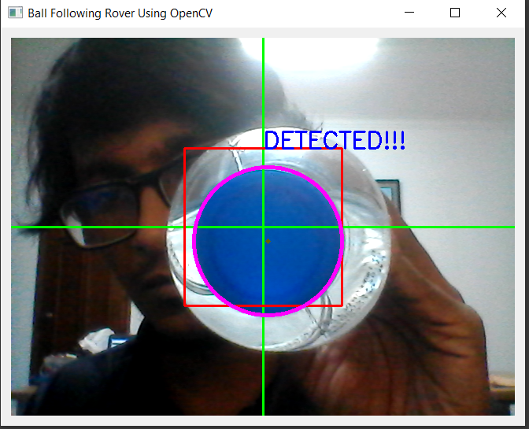
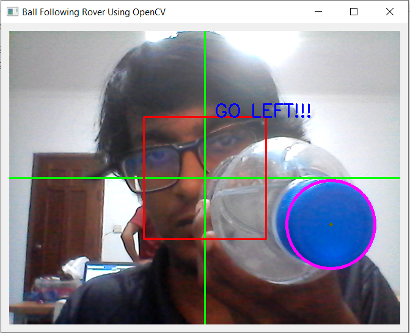
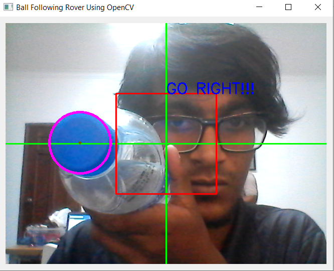

# Computer-Vision-Based-Ball-Following-Rover
A minimal algorithm using single webcam to navigate rover towards a detected object(Ball).

```
pip install PyQt5
pip install opencv-python
pip install numpy
```

## Ideas:
- use Python Example to integrate with Arduino for any kind of hardware projects based on OpenCV.

### Preview




